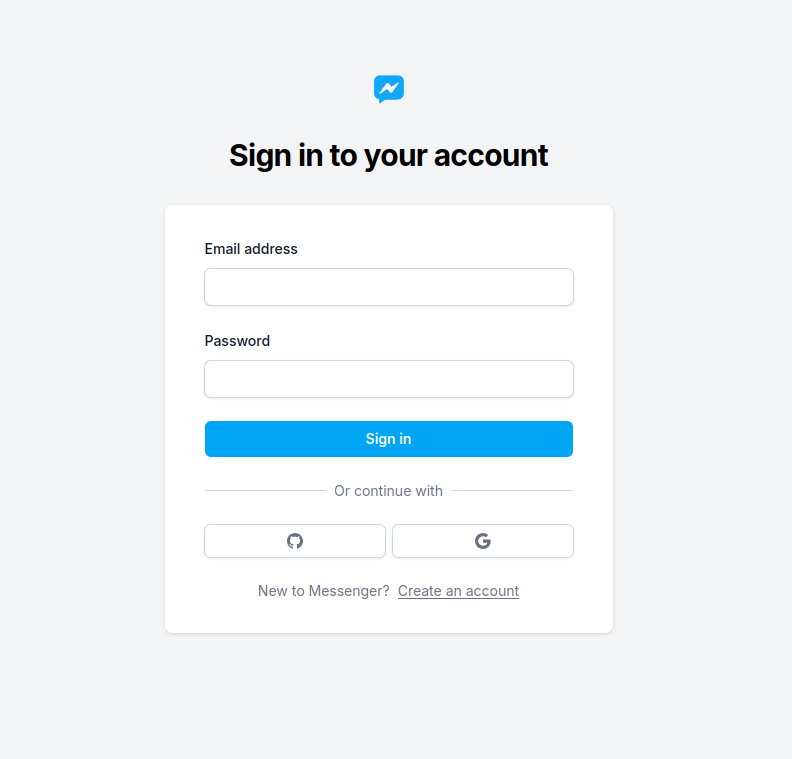
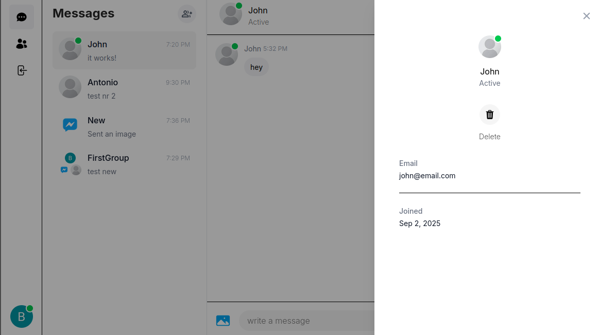
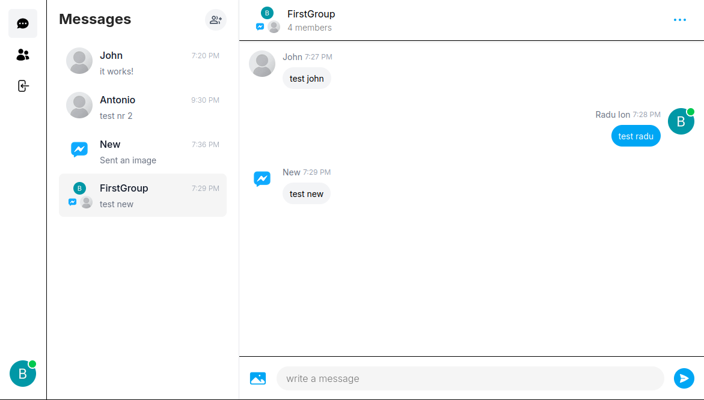

A full-stack real-time messenger application built with Next.js 14, MongoDB, Prisma, NextAuth.js, and Pusher. It supports secure authentication, real-time messaging, group chats, image sharing, and a modern responsive UI.

## Features
 - **Real-Time Messaging** – Instant conversations and status tracking (online/offline) powered by _Pusher_.
 - **Authentication** - Login/register with NextAuth.js, supporting multiple authentication strategies, including credential-based login and social sign-ins with both _Google_ and _GitHub_.
 - **Persistent Storage** – All user data, conversations, and messages references are securely stored in _MongoDB Atlas_, ensuring scalability and reliability.
 - **Group Messaging** – Users can create, join, and manage group conversations.
 - **Media Uploads** – Image uploading and sharing with _Cloudinary_ integration.
 - **Notifications** – User-friendly feedback with _react-hot-toast_.
 - **User Interface**: A modern and fully responsive design crafted using _Tailwind CSS_.
- **Form Handling** – Smooth validation and submission using _react-hook-form_.

## Dependencies
This project leverages modern libraries and frameworks to ensure scalability and performance:

 - Next.js 14 – React framework for full-stack apps.
 - Prisma – Type-safe ORM for intuitive database access.
 - NextAuth.js – Authentication for multiple providers.
 - Pusher – Real-time WebSocket communication.
 - react-hook-form – Performant form handling.
 - Cloudinary – Cloud media management.
 - react-hot-toast – Toast notifications.
 - bcrypt – Password hashing & verification.
 - axios – Promise-based HTTP client.
 - zustand – Simple, scalable state management.
 - lodash – Utility functions for data manipulation.

## Getting Started  

### 1. Clone the repository  
```bash
git clone https://github.com/BalasaRadu/messenger-clone.git
cd messenger-chat
```

### 2. Install dependencies
```bash
npm install
```

### 3. Configure environment variables
Create a ``.env`` file in the root directory and add:
```bash
# MongoDB Atlas connection string
DATABASE_URL="mongodb+srv://<username>:<password>@cluster0.mongodb.net/<database_name>?retryWrites=true&w=majority"

# NextAuth configuration
NEXTAUTH_SECRET=your_secret_key
NEXTAUTH_URL=http://localhost:3000

# Pusher configuration
PUSHER_APP_ID=your_pusher_app_id
PUSHER_KEY=your_pusher_key
PUSHER_SECRET=your_pusher_secret
PUSHER_CLUSTER=your_pusher_cluster

# Cloudinary configuration
CLOUDINARY_CLOUD_NAME=your_cloud_name
CLOUDINARY_API_KEY=your_api_key
CLOUDINARY_API_SECRET=your_api_secret
```

### 4. Set up Prisma
```bash
npx prisma generate   # Generates Prisma Client
npx prisma db push    # Pushes schema to MongoDB Atlas
```

### 5. Run the development server
```bash
npm run dev
```

Visit [http://localhost:3000](http://localhost:3000)

## 📸 Screenshots  

### Login Page  
  

### Chat Interface  
  

### Group Chat Example
  
